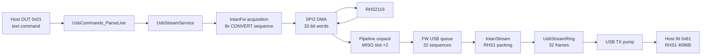
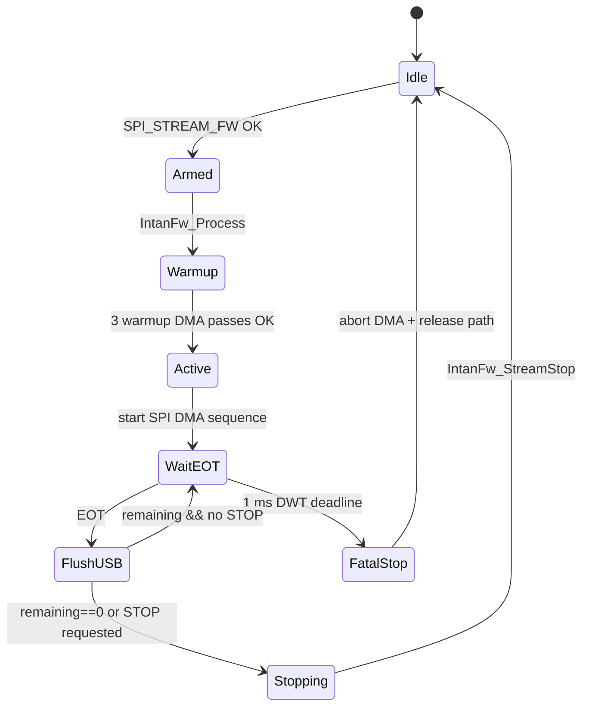

# Архитектура ПО

Firmware состоит из boot/clock layer, Intan SPI/DMA layer, Framework acquisition path, `IntanStream` packer, frame ring и USB Vendor Bulk service. Основной production path идёт через `SPI_STREAM_FW`, а не через legacy `SPI_STREAM_REAL*`.

## Основной цикл

`main()` выполняет:

1. `MPU_Config()` - D2 SRAM `.dma_buffer` помечается non-cacheable.
2. `HAL_Init()`, capture reset cause для IWDG.
3. `SystemClock_Config()` - HSE/PLL, SYSCLK 480 MHz по умолчанию.
4. `MX_GPIO_Init()`, USART1, RTC, затем SPI2 при `INTAN_HW_PRESENT=1`.
5. `Intan_SPI_Init()`, `Intan_ChipBringup()`, USB device, stream service, IWDG.
6. Бесконечный loop: команды OUT, USB TX pump, acquisition processing, UART RX parser, watchdog refresh.

Для DWT-paced/FREERUN Framework stream есть tight hot loop: он чаще вызывает `UsbVendorBulk_ProcessOutCommands()`, `UsbStreamService_TxPump()` и `IntanFw_Process()`, чтобы принимать `STOP` и не задерживать USB.

## Поток данных

В production RR8 `IntanFw_Process()` строит последовательность из 8 `CONVERT`, запускает SPI DMA, ждёт EOT, распаковывает ADC с pipeline offset `+2`, кладёт 8 значений в маленькую FW-очередь и затем отдаёт их в `IntanStream`.

## `IntanStream` и ring buffer

`IntanStream` открывает frame через `UsbStreamRing_AcquireFilling()`, заполняет header `RHS1`, пишет payload и закрывает frame через `UsbStreamRing_MarkReady()`.

| Компонент | Роль |
| --- | --- |
| `UsbStreamFrame` | ABI 4096 байт, header + response payload |
| `UsbStreamRing` | 32 frame buffers в `.dma_buffer` |
| Ready FIFO | FIFO указателей глубиной 64 |
| `UsbStreamService_TxPump()` | Берёт ready frame и отправляет `USBD_VENDOR_BULK_TransmitFrame()` |
| TX complete callback | Только ставит флаг; main позже освобождает frame |

Producer не ждёт USB. Если нет свободного frame или ready FIFO переполнен, firmware увеличивает `usb_overflow_count`; при потере текущих samples дополнительно растёт `samples_dropped`.

## Framework acquisition state machine

STOP не рвёт sequence посередине. `STOP` через USB только ставит `s_stop_requested` и вызывает `IntanFw_RequestStop()`. Teardown выполняется в main после EOT или когда `s_xfer_state == FW_XFER_IDLE`.

## STOP и disconnect teardown

При `STOP`, новой команде или USB disconnect firmware:

1. Запрашивает останов Framework stream.
2. Ждёт границы EOT, если SPI DMA sequence активна.
3. Вызывает `USBD_VENDOR_BULK_AbortFrame()`, если IN frame transfer активен.
4. Сбрасывает `IntanStream`, `UsbStreamRing`, SPI DMA state и DMA path ownership.
5. На обычный `STOP` отправляет текстовый `OK`.

На disconnect/reset событие лочится через счётчики `g_usb_ev_disconnect`/`g_usb_ev_reset`, а `usb_disconnect_count` попадает в `STATS`.

## IWDG и fault handling

IWDG1 имеет номинальный timeout около 3 s и refresh period 250 ms. `Iwdg_RefreshIfHealthy()` вызывается только если нет fatal FW DMA error и не идёт disconnect teardown.

Fault context пишется в `.noinit` D3 SRAM:

| `last_fault` | Fault |
| ---: | --- |
| 1 | HardFault |
| 2 | MemManage |
| 3 | BusFault |
| 4 | UsageFault |
| 5 | NMI |

`iwdg_reset` отражает reset от IWDG1 и зеркалируется через RTC backup register. PB6 используется для blink-кодов: HardFault - 3 группы по 3 вспышки; остальные fault - 2/4/5/6 вспышек.

## Диагностические пути

`SPI_STREAM`, `SPI_STREAM_REAL*`, `SPI_STREAM_RR8*`, `SPI_STREAM_RANGE_REAL*`, `SPI_TO_RAM*` и `SPI_RATE*` полезны для тестов USB/SPI, но не являются production acquisition. Подробности команд: [05_commands.md](05_commands.md), production details: [06_acquisition.md](06_acquisition.md).
